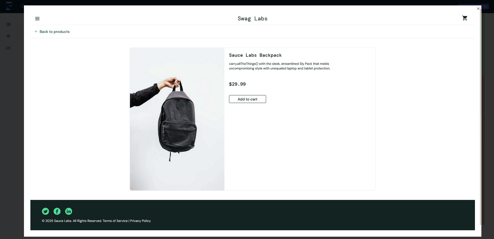
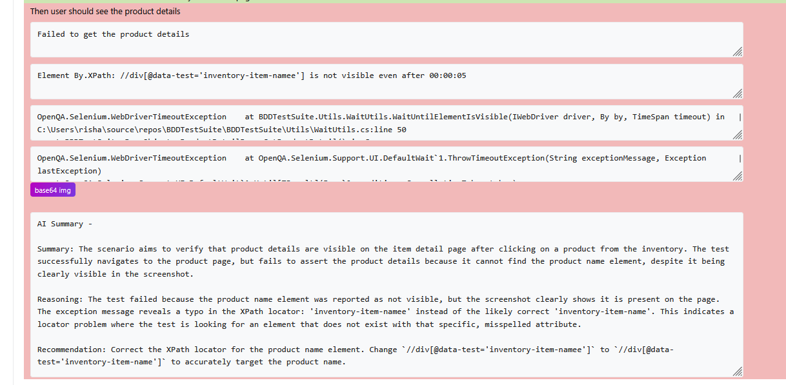
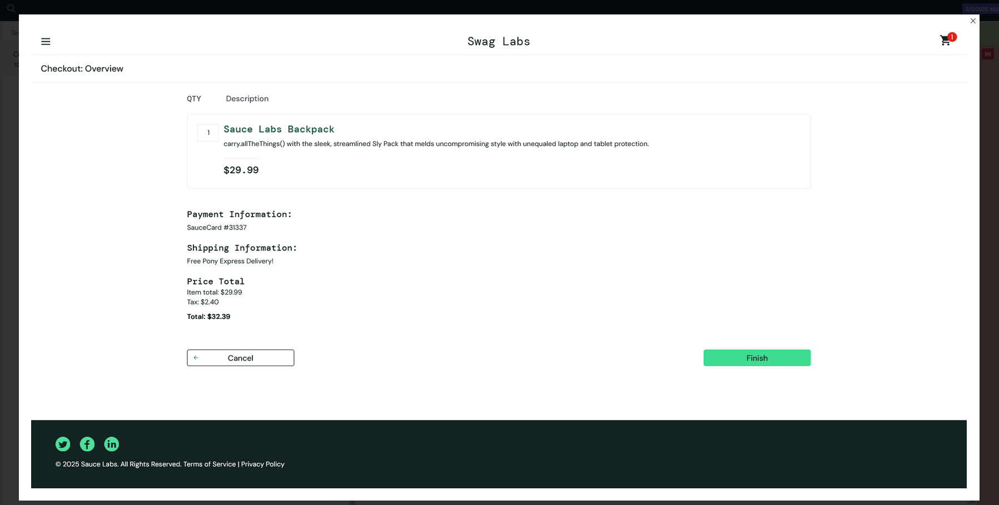
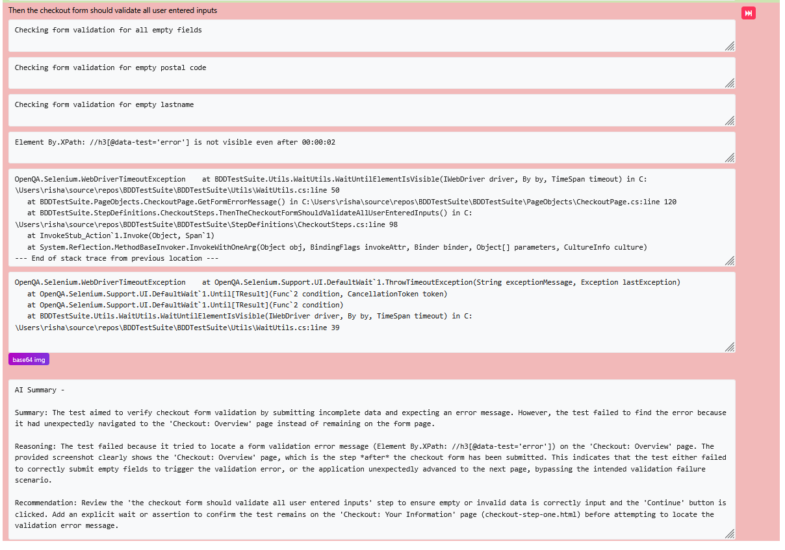
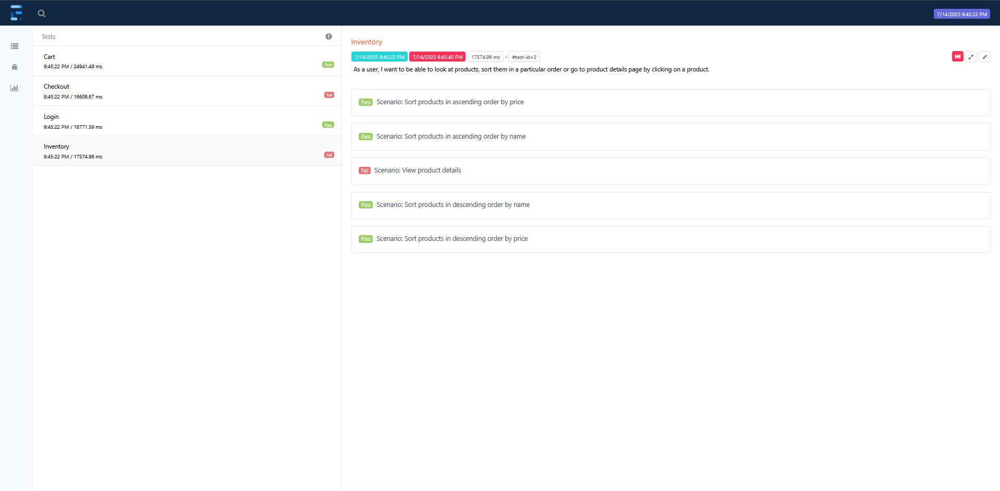
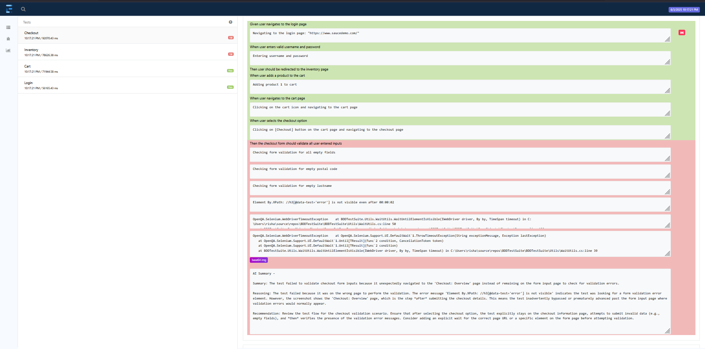
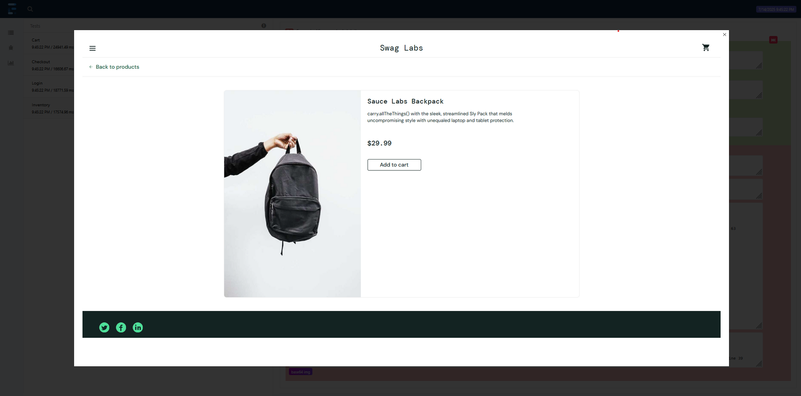
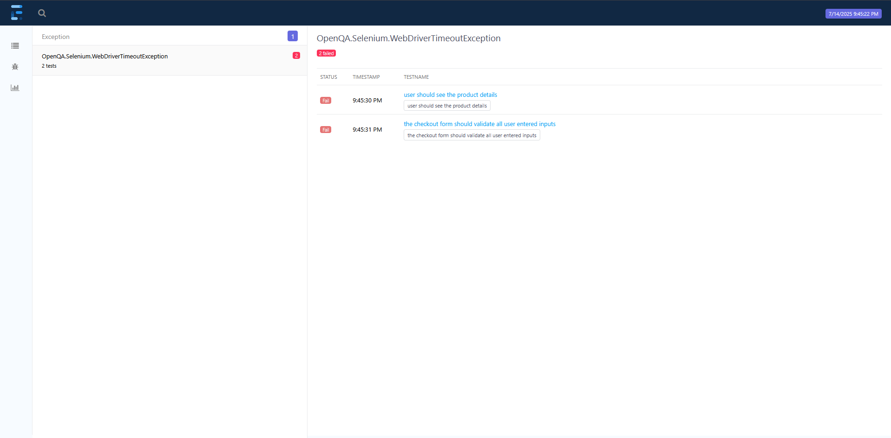

# BDDTestSuite with AI-Powered Analysis, Root Cause Detection & Summaries
BDDTestSuite is a comprehensive end-to-end testing framework for an e-commerce web application, built on .NET 8 with Selenium WebDriver, Reqnroll (SpecFlow) and xUnit. Following a Behavior-Driven Development (BDD) workflow, it uses Gherkin feature files to describe user journeys and step definitions to drive the automation. Integrates Google’s Gemini API to deliver AI-driven analysis, root-cause detection and natural-language summaries of your test results.  

## Table of Contents

- Project Structure
- Configuration Management
- Logging
- Utility Classes
- AI-Powered Analysis, Root Cause Detection & Summaries
- Reporting
- Scenarios & Features

## Project Structure

```
BDDTestSuite/ 
├── Features/ # Gherkin feature files describing scenarios 
├── Models/ # Data models (e.g., Product) 
├── PageObjects/ # Page Object Model classes for UI abstraction 
├── StepDefinitions/ # Step definitions mapping Gherkin steps to code 
├── Utils/ # Utility/helper classes (browser, waits, etc.) 
├── config.json # Test configuration (browser, credentials, etc.) 
├── Hooks.cs # Test lifecycle hooks (setup/teardown)
```

## Configuration Management

Configuration is managed via config.json which contains:

- The base URL of the application
- Browser selection (`chrome`, `firefox`, `edge`)
- Test user credentials (standard, locked-out, etc.)

Example:
```
{
    "url": "<https://www.saucedemo.com/>",
    "browser": "firefox",
    "username": {
        "standard-user": "standard_user",
        "locked-out-user": "locked_out_user"
    },
    "password": {
        "valid": "secret_sauce",
        "invalid": "invalid_pass"
    }
}
```
Configuration is loaded at test startup in ```Hooks``` using ```Microsoft.Extensions.Configuration```.
```
IConfigurationRoot configuration = new ConfigurationBuilder()
    .AddJsonFile("config.json")
    .AddEnvironmentVariables()
    .Build();

string browser = configuration["browser"];
```

## **Logging**

Logging is implemented using Serilog. Logs are written both to the console and to a file (`log.txt`). Each scenario's log entries are tagged with the scenario name for traceability.

- Log output includes timestamps, log level, scenario name, and message.
- Logging is initialized in `Hooks`.
- Each step and page object method logs key actions and errors.

Example log entry:

```[18:27:10 INF] [Scenario: Sort products in ascending order by price] Navigating to the login page: https://www.saucedemo.com/```

## **Utility Classes**

Utility classes in `Utils/` provide reusable helpers:

- `BrowserUtil`: Browser initialization and navigation.
- `WaitUtils`: Explicit waits for elements (visible, clickable, URL changes, etc.).
- `ElementUtils`: JavaScript-based element interactions (e.g., JS click).
- `ReportUtils`: Step node creation and failure logging.
- `ScreenshotUtils`: A utility class that captures full‑page browser screenshots and returns them as Base64‑encoded strings.

These utilities help keep step definitions and page objects clean and robust.

## **AI-Powered Analysis, Root Cause Detection & Summaries**  

1. **Automated Test Result Summaries**
   - After each test run, the suite calls Gemini to generate a concise, natural-language overview of failed scenarios.
  
2. **Insight Extraction**  
   - Leveraging feature names, scenario steps, logs, and screenshots, Gemini extracts root causes, identifies common failure patterns, and pinpoints potential sources of test flakiness.
  
3. **ExtentReports Integration**
   - The generated summary is seamlessly appended to the scenario's failed step in the report, embedding AI-driven insights directly alongside your test results.
  
### Failed Scenario Analysis Overview 
 - A snapshot of the report highlighting a failed inventory test, where the AI correctly pinpoints an incorrect element locator as the root cause of the failure.


- A snapshot of the report showing a failed checkout form test, where the AI pinpoints that the test bypassed the checkout form page and proceeded to the subsequent page.



## **Reporting** 

This automation test suite integrates **Extent Reports** and **Serilog** to give you rich, step‑by‑step insights into every test run:

1. **Extent Reports**  
   - Generates an HTML report for each test run.  
   - Automatically attaches a screenshot whenever a test fails, making it easy to see exactly what went wrong.

2. **Serilog Sink for In‑Test Logging**  
   - A custom **Serilog sink** captures all log events emitted during a test.  
   - Log events are queued per test execution and then dequeued when attaching to Extent Report nodes.  
   - Each BDD step node in the report includes its own detailed log output, so you can trace the exact sequence of actions and messages.

3. **AI Scenario Summary Integration**
   - The generated summary is seamlessly appended to the scenario's failed step in the report, embedding AI-driven insights directly alongside your test results.

### Feature View

### Failed Scenario View

### Failed Scenario Screenshot View

### Exception Page View



## **Scenarios & Features**

Scenarios are defined in Gherkin feature files under `Features/`:

- **Login** (Login.feature): Valid/invalid login, locked-out user, empty credentials.
- **Inventory** (Inventory.feature): Viewing product details, sorting products by name/price.
- **Cart** (Cart.feature): Adding/removing products, verifying cart contents.
- **Checkout** (Checkout.feature): Form validation, overview page, completing purchases.

Each scenario is mapped to step definitions in `StepDefinitions/`, which use page objects and utilities to interact with the application.


